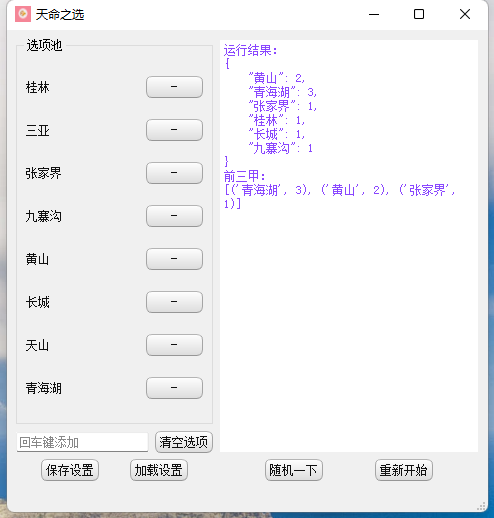

# 天命之选

[toc]

## 介绍
生活中的你，是不是时常犹豫不决，患得患失？
但是，天命之选，它来了！！
这款随机工具，直接帮你实现选择自由，做出你的天命选择！

## 界面展示


## 软件架构
软件架构说明
pyqt5 做的随机工具， 可以自由增删选项池， 自由加载配置。

## 环境搭建
```bash
conda env create -f freeze.yml

pip install -r requirements.txt
```

## 打包
```bash
pyinstaller -i statics/food.ico -n tian_xuan main_gui.py
```
